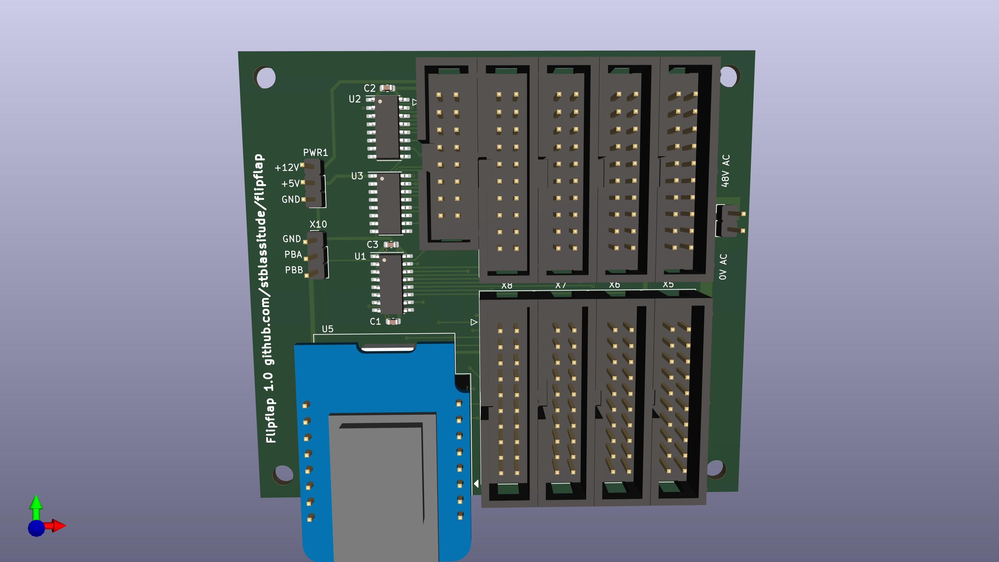

# Controller for OMEGA OM3021 Split-Flap Displays

# Overview
The controller board uses an D1 mini ESP8266 microcontroller to control a number of outputs going to the displays, and read inputs connected to the display encodes, which give the current position of the rotor with the split flaps.

The controller can address 8 lines and 15 columns, for a total of 120 characters. With the displays currently available to us, we're using 6 lines with 11 columns, for a total of 66 characters.

The schematic [flipflap-sch.pdf](flipflap-sch.pdf) and the assembly diagram [flipflap-pcb.pdf](flipflap-pcb.pdf) show the details of the board.

# Software
Software is currently under development, and will be linked here.

# Documentation OMEGA OM3021
Documentation for the split-flap display model can be found in [docs/](docs/). [Theory of Operation](docs/theory-of-operation.md) tries to explain how a microcontroller can control the displays.

