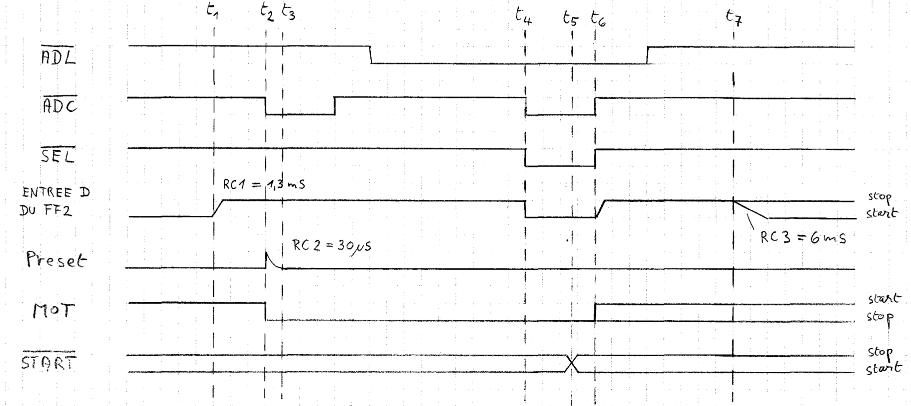

# OMEGA OM3021 Split Flap Display

## Theory of Operation

The [Timing Diagram](OMEGA_OM3021_Timing_diagram.pdf) has this description (translated from the original French):
> When the strobe brush touches the copper track (t1), the D input of FF2 goes up to "1". RC1 ensures a "clean" edge despite the contact bounces. At the first edge of ADC after RC1 an impulse, formed by RC2, causes a preset and the motor is stopped (t2).
> 
> From t3, i.e. after RC2, the encoder is ready to be read.
> 
> During t4-t5, the µP reads the encoder status. The decision of the µP to leave the motor stopped or to start it intervenes in t5 and the transfer is done in t6.
> 
> At t7 the strobe brush leaves the copper track. RC3 ensures a clean falling edge.

### Components and Circuit

This is a more detailed description of how the microcontroller controls the motor to move the display to the desired position.

One split-flap display consists of these components:
* The split flaps on their rotor
* A motor to drive the rotor
* An encoder that shows the position of the rotor, in this case, as an absolute 6 bit digital signal
* A control board helping to control the motor and read out the encoder

### Control Board
The control board ([schematics](OMEGA_OM3021_Schema.pdf)) is designed so that multiple displays can be connected on a bus. These signals are being used:
* Power: 0V/GND, 5V (logic), 12V (communications), 0VAC and 48V (motor)
* /START: start the motor (inverted)
* /ADL: selects a line (row) of displays (inverted)
* /ADC: selects a column of displays (inverted)
* /DATA0 to /DATA5: the output of the encoders

In a typical assembly, a number of displays are all connected to a bus, forming a line/row. Each individual display is selected through /ADC. Multiple rows can be connected together, as long as every row has its own /ADL. Using two 8 bit registers, it would be possible to address 8 rows with 8 displays each, for a total of 256 display. (Because of the length of the bus in this case, it is likely that capacitance of the cabling will require careful driving of the signals.)

All signals are on a 10x2 connector P3, except for /ADC, which is on P1.

While the control board uses 5V to supply the CD40xx series gates and flip-flops, the communication signals are all 12V. On the input side of the control board, /START, /ADL, and /ADC use a 27k/10k voltage divider with a 1N4148 protection diode to convert the 12V signal to something the CD40xx will tolerate. The /DATA signals are open collector driven to GND (see T4 and the encoder contacts), with a 1N4148 for each, allowing a separate logic level on the microcontroller side.

The control board controls the motor through triac T2, by decoding a number of signals from the microcontroller, and enabling the output of the encoder.

### Encoder
The encoder is an electro-mechanical device with seven circular copper tracks on a disc. All patterns are connected together. The disc is fixed to the rotor shaft. Six tracks indicate the absolute position of the rotor (either having copper or no copper in a particular position), while the strobe track alternates between copper and no copper inside each position. There are two encoder models, with either [40](OMEGA_OM3021_Codage_du_DIsque_40_pos.pdf) or [62](OMEGA_OM3021_Codage_du_DIsque_62_pos.pdf) positions. Note that each pattern has at least one of the data bits set, so that a connection is made between the strobe line and at least one data line.

### Moving the Rotor to the Desired Position

The microcontroller has to control stepping the rotor to the desired position. The [Timing Diagram](OMEGA_OM3021_Timing_diagram.pdf) contains both the timing and a schematic of the relevant parts; we reference some parts from the main [schematics](OMEGA_OM3021_Schema.pdf), in particular the RC circuits.

Changing the rotor position starts from steady state and involves these steps in a loop:
1. The current position is obtained by asserting /ADL and /ADC (setting it low) to address the desired module, and then reading /DATA0 to /DATA5 (t4). T4 is on because /ADL and /ADC are low, and the motor is off, pulling STROBE, and therefor all data lines, to ground, leading to a low level on the data lines where they are present on the tracks.
2. If the position is the desired one, the micro controller keeps /START at high, and /ADL and/or /ADC are set high to deassert, and the loop ends.
3. The micro controller turns on the motor by pulling /START low (t5) while releasing /ADC (t6). This resets FF1, and turns on the motor. It also turns off T4, and clocks FF2, resetting it because the data input is low. The pull-ups on the data lines plus R4 and C3 form RC1, with a tau of 1.3ms, eventually leading to the data input in FF2 going high (right after t6).
4. As the rotor moves, the encoder will eventually leave the copper on the strobe track (t7). This will activate RC3 (C3, R4, R12, tau 6ms), and pull the data input of FF2 low. 
6. As the rotor continues to move, the strobe track will get back to copper (t1), pulling the data input of FF2 high again (RC1).
5. The micro controller repeatedly asserts /ADC, which clocks FF2. If the output from FF2 is high (t2), this starts RC2 (C4, R1, 0.3ms), creating a pulse on the internal PRESET line, setting FF1 and stopping the motor. (Editors note: it is unclear if the µC has to have good timing for the motor to advance to the exact position, or if it is sufficent to poll /ADC frequently, and rely on the contoller board to stop the motor at the correct time. It does seem though that missing the window where STROBE is connected will make the rotor advance to the next position.)
6. The loop then continues with checking if the desired position has been reached.

### Power on Reset

(Editors note: it is unclear if the controller is in a well defined state after power on. It might be necessary to run through the loop at least once to make sure the motor is off. T1, R2, and C1 look like they might be a reset circuit pulling PRESET high for 1µF\*1MΩ = 1s).

## Microcontroller Setup

The microcontroller needs these I/Os to control the displays:
* A number of 12V-tolerating open-collector outputs for /ADC to select the columns
* A number of 12V-tolerating open-collector outputs for /ADL to select the lines
* A 12V-tolerating open-collector output for /START
* 6 12V-tolerating inputs for /DATA0 to /DATA5